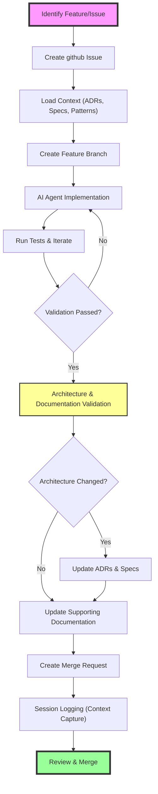

# Contributing to OSDU MCP Server

This project uses an AI-agent driven development workflow, combining automated coding with human oversight to ensure consistent, high-quality implementations.

> This AI-agent driven workflow ensures quality through structure, testing, architecture evaluation, and human oversight.

## Core Principle

Architecture comes first. Specifications define behavior, ADRs capture decisions, and implementation follows. The defined workflow ensures that if each step is followed — from context loading to validation and documentation — code quality and test coverage become natural outcomes, not afterthoughts.

By adhering to this process, the AI avoids introducing technical debt and stays aligned with the bigger picture of the project. This disciplined approach ensures sustainable, high-quality contributions without sacrificing long-term maintainability.

## Contribution Steps

### 1. Issue Creation

In this AI-agent driven workflow, issue creation often starts with the AI analyzing user inputs or detecting functionality gaps. The AI refines these into a well-defined github issue, validating against existing specifications and architectural decisions.

An issue documents the problem, proposed solution, and acceptance criteria, establishing a clear task definition before implementation. This ensures every change is traceable and aligned with project goals.

```bash
gh issue create -t "Title" -d "Description" -l enhancement
````

### 2. Branch Creation

Once an issue is established, the AI agent or developer proceeds to create a feature branch. This step keeps work organized and clearly associated with its issue.

Branches follow a consistent naming pattern:

```bash
git checkout -b agent/<issue-number>-<short-description>
```

This ensures branches are traceable and easy to navigate during development and review.

### 3. Context Loading

Before starting implementation, the AI agent performs context loading to ensure it operates with full awareness of the project’s architectural guidelines and coding standards. This involves analyzing relevant ADRs, specifications, existing code patterns, and testing strategies.

By fully loading this context, the AI can make informed decisions, maintain consistency with established practices, and integrate new features smoothly into the codebase.

### 4. Implementation & Validation

The AI agent implements new functionality guided by architectural patterns and specifications, using a test-driven development approach.

Validation is an iterative loop where tests are created, executed, and used to refine both the code and tests themselves. This process continues until the desired behavior is consistently verified.

Validation focuses on behavior-driven tests (ADR-010) with a strict minimum of 80% coverage. This ensures correctness, closes the feedback loop, and confirms adherence to project standards.

### 5. Architecture & Documentation Validation

After successful implementation and validation, the AI agent reassesses the project's architecture and design decisions. This evaluation determines whether the work has introduced changes that impact existing ADRs, requires new architectural decisions, or subtly evolves current patterns.

This step ensures ADRs and specifications remain accurate, living documents that grow with the code. By closing this loop, the AI keeps documentation aligned with the evolving system, preserving architectural clarity and supporting sustainable development.

#### Updating AI_EVOLUTION.md

When completing significant features or architectural changes, update AI_EVOLUTION.md with:
- The challenge that was solved
- Key insights or patterns discovered
- Lessons learned for future development
- Evolution of existing patterns

This creates a knowledge base that helps future AI agents understand not just what exists, but why it exists.

### 6. Merge Request

After validation and documentation updates, the AI agent prepares a Merge Request (MR) to propose integrating changes into the main branch.

The MR links back to the issue, summarizes the work, and confirms tests pass. Commit messages follow Conventional Commits for Release Please automation.

Example commit:

```bash
git commit -m "fix(auth): correct token expiration handling"
```

Example MR creation:

```bash
gh mr create -t "Fix token expiration" -d "Closes #42: Corrects token expiration logic." --target-branch main
```

Commit messages follow the Conventional Commits format for compatibility with Release Please automation. Human reviewers approve and merge, ensuring oversight and architectural consistency.

### 7. Session Logging

At the end of each development cycle, the AI agent records a session log to capture essential context from the work performed. This log summarizes key decisions, technical challenges, architectural impacts, and lessons learned.

Session logs serve as an evolving memory for ongoing workstreams, enabling the AI to 'remember' past activities, maintain continuity across phases, and provide rich context when revisiting or expanding on larger features and epics.

By preserving this knowledge, session logs ensure the AI stays aligned with project goals and maintains situational awareness throughout long-running initiatives.

## Working with GitHub Copilot Coding Agent

This project is optimized for collaboration with GitHub Copilot coding agent. To assign tasks to Copilot:

1. **Create Well-Scoped Issues**: Use the "Copilot Task" issue template
2. **Apply the 'copilot' Label**: This automatically assigns the issue to @Copilot
3. **Clear Acceptance Criteria**: Define exactly what success looks like
4. **Reference Patterns**: Point to existing code patterns to follow
5. **Specify Files**: List which files need modification

Copilot will:
- Follow the patterns defined in `.github/copilot-instructions.md`
- Use the pre-configured development environment
- Run quality checks before creating pull requests
- Respond to review comments for iterations

Best tasks for Copilot:
- Adding new tools following existing patterns
- Improving test coverage
- Fixing type errors or lint issues
- Updating documentation
- Small, well-defined features

Avoid assigning Copilot:
- Major architectural changes
- Security-critical modifications
- Complex cross-service refactoring
- Ambiguous or exploratory tasks

## Development Workflow Overview


