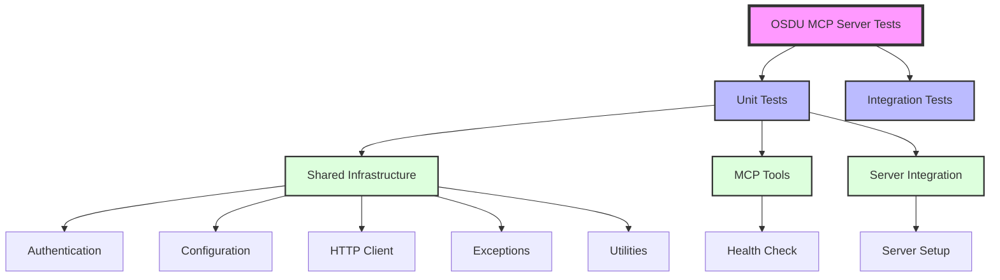
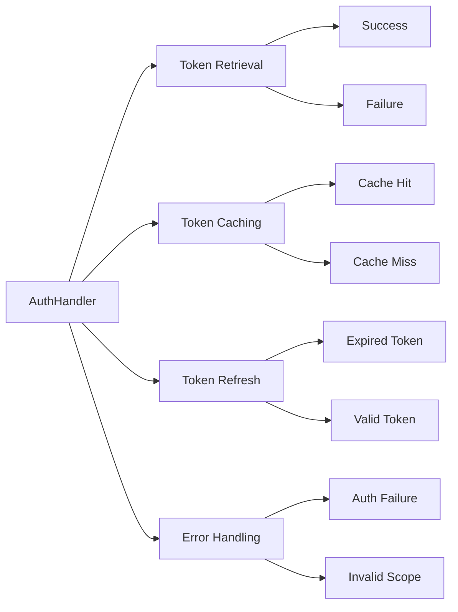
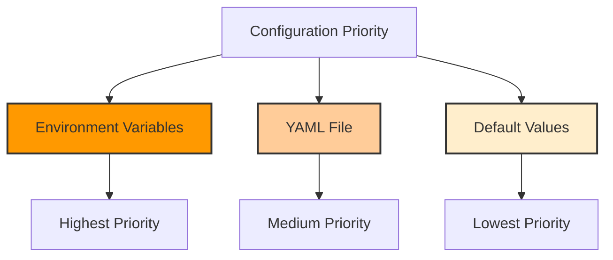

# OSDU MCP Server Test Plan

This document outlines the test strategy, architecture, and comprehensive test coverage for the OSDU MCP Server project.

## Test Philosophy

Following [ADR-010: Testing Philosophy and Strategy](../docs/adr.md#adr-010-testing-philosophy-and-strategy), we adopt a **behavior-driven testing approach** that focuses on testing what code does rather than how it does it.

### Core Principles

1. **Test Boundaries, Not Implementation**: Mock only at service boundaries (HTTP, auth providers)
2. **Behavior-Focused**: Test observable outcomes, not internal implementation details
3. **Appropriate Tools**: Use specialized mocking libraries (e.g., `aioresponses` for HTTP)
4. **Readable Tests**: Each test should be self-documenting and understandable in isolation

## Test Structure



## Test Coverage by Component

### Shared Infrastructure Tests

| Component | Test File | Test Coverage | Purpose |
|-----------|-----------|---------------|---------|
| Authentication | `test_auth.py` | 7 tests | Validates Azure authentication behavior, token management, and error handling |
| Configuration | `test_config.py` | 10 tests | Tests configuration priority hierarchy, value parsing, and error scenarios |
| HTTP Client | `test_osdu_client.py` | 7 tests | Verifies HTTP operations, retry logic, and error handling |
| Exceptions | `test_exceptions.py` | 9 tests | Tests exception hierarchy and MCP error transformation |
| Utilities | `test_utils.py` | 6 tests | Validates timestamp formatting and dictionary operations |

### Tool Tests

| Tool | Test File | Test Coverage | Purpose |
|------|-----------|---------------|---------|
| Health Check | `test_health_check.py` | 5 tests | Validates platform connectivity, service health, and error reporting |

### Server Tests

| Component | Test File | Test Coverage | Purpose |
|-----------|-----------|---------------|---------|
| MCP Server | `test_server.py` | 2 tests | Verifies server initialization and tool registration |

## Test Scenarios by Category

### Authentication Tests (`test_auth.py`)



| Test Scenario | Purpose | Method |
|---------------|---------|--------|
| Token retrieval success | Verify successful token acquisition | Mock Azure credential response |
| Token caching | Ensure tokens are cached to avoid unnecessary calls | Verify single token request |
| Token refresh on expiry | Test automatic refresh of expired tokens | Mock expired token scenario |
| Credential exclusions | Validate configuration of allowed credentials | Check DefaultAzureCredential setup |
| Authentication failure | Handle auth errors gracefully | Mock credential failure |
| Token validation | Verify token validation behavior | Mock validation responses |
| Resource cleanup | Ensure proper cleanup on close | Check credential cleanup |

### Configuration Tests (`test_config.py`)



| Test Scenario | Purpose | Method |
|---------------|---------|--------|
| Environment priority | ENV vars override YAML | Set env var and verify precedence |
| YAML fallback | Use YAML when env not set | Mock YAML content, test retrieval |
| Default fallback | Return defaults when nothing set | Test with no env or YAML |
| Required config error | Error when required config missing | Test get_required with missing value |
| Boolean parsing | Parse 'true'/'false' from env | Set env vars with boolean strings |
| Numeric parsing | Parse numbers from env | Set env vars with numeric strings |
| YAML error handling | Handle missing/invalid YAML | Mock file not found |
| Get all config | Retrieve complete configuration | Test get_all_config method |
| Custom config file | Support alternate config files | Test with custom file path |

### HTTP Client Tests (`test_osdu_client.py`)

| Test Scenario | Purpose | Method |
|---------------|---------|--------|
| Successful GET | Test basic GET operation | Mock successful HTTP response |
| POST with data | Test POST with JSON payload | Mock POST response, verify payload |
| API error handling | Handle HTTP error codes | Mock 404/500 responses |
| Retry logic | Verify exponential backoff | Mock temporary failures |
| Max retry failure | Fail after max attempts | Mock persistent failures |
| Session reuse | Efficient connection pooling | Verify single session creation |
| Header formatting | Correct auth/partition headers | Verify request headers |

### Exception Tests (`test_exceptions.py`)

| Test Scenario | Purpose | Method |
|---------------|---------|--------|
| Exception hierarchy | Verify inheritance structure | Test isinstance relationships |
| Error transformation | Convert to MCP errors | Test decorator error handling |
| Status code handling | Include HTTP status in errors | Test API errors with codes |
| Generic error handling | Handle unexpected errors | Test with generic exceptions |
| Successful execution | No error transformation | Test normal execution path |

### Health Check Tests (`test_health_check.py`)

| Test Scenario | Purpose | Method |
|---------------|---------|--------|
| All services healthy | Verify successful health check | Mock all service responses |
| Authentication failure | Handle auth errors | Mock auth failure |
| Service unavailable | Report unhealthy services | Mock service errors |
| No service check | Skip service checks | Test with include_services=False |
| Version information | Include service versions | Test with include_version_info=True |

## Test Execution Strategy

### Running Tests

```bash
# Run all tests
uv run pytest

# Run with coverage
uv run pytest --cov=osdu_mcp_server --cov-report=html

# Run specific test file
uv run pytest tests/shared/test_auth.py

# Run with verbose output
uv run pytest -v

# Run tests matching pattern
uv run pytest -k "auth"
```

### Coverage Requirements

- **Target**: >90% code coverage
- **Focus**: Behavior coverage over line coverage
- **Exclusions**: Abstract base classes, type definitions

### Performance Requirements

- **Unit Tests**: < 100ms per test
- **Integration Tests**: < 5s per test
- **Total Suite**: < 10s for all tests

## Test Development Guidelines

### Writing New Tests

1. **Follow ADR-010** - Write behavior-focused tests
2. **Use appropriate mocking** - Mock only external boundaries
3. **Clear naming** - Test names should describe behavior
4. **One behavior per test** - Keep tests focused and simple
5. **Self-documenting** - Tests should be readable without comments

### Example Test Pattern

```python
# Good: Behavior-focused test
@pytest.mark.asyncio
async def test_client_retries_on_temporary_failure():
    """Test that client retries failed requests with backoff."""
    with aioresponses() as mocked:
        # First two attempts fail, third succeeds
        mocked.get("https://osdu.com/api/test", status=500)
        mocked.get("https://osdu.com/api/test", status=500)
        mocked.get("https://osdu.com/api/test", 
                  payload={"result": "success"})
        
        client = OsduClient(config, auth)
        result = await client.get("/api/test")
        
        assert result["result"] == "success"
        assert len(mocked.requests) == 3  # Verify retry behavior
```

### Test Maintenance

1. **Review on refactoring** - Update tests when behavior changes
2. **Remove obsolete tests** - Delete tests for removed features
3. **Monitor coverage** - Ensure new code includes tests
4. **Performance monitoring** - Track test execution time

## Future Test Enhancements

1. **Integration Tests** - Add end-to-end tests with real OSDU
2. **Performance Tests** - Add benchmarking for critical paths
3. **Contract Tests** - Verify MCP protocol compliance
4. **Security Tests** - Add authentication/authorization tests
5. **Load Tests** - Verify behavior under concurrent load

## References

- [ADR-010: Testing Philosophy and Strategy](../docs/adr.md#adr-010-testing-philosophy-and-strategy)
- [pytest Documentation](https://docs.pytest.org/)
- [aioresponses Documentation](https://github.com/pebble/aioresponses)
- [Python Testing Best Practices](https://docs.pytest.org/en/latest/explanation/goodpractices.html)